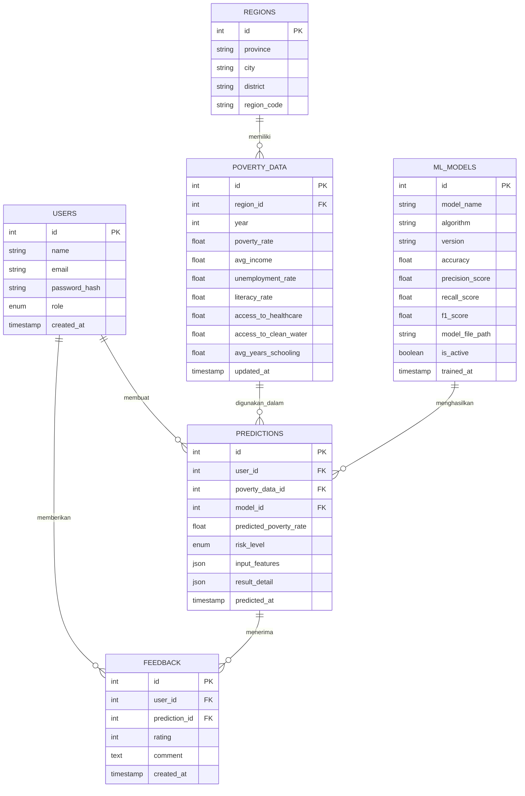

```mermaid
erDiagram
  USERS ||--o{ PREDICTIONS : membuat
  USERS ||--o{ FEEDBACK : memberikan
  REGIONS ||--o{ POVERTY_DATA : memiliki
  POVERTY_DATA ||--o{ PREDICTIONS : digunakan_dalam
  PREDICTIONS ||--o{ FEEDBACK : menerima
  ML_MODELS ||--o{ PREDICTIONS : menghasilkan

  USERS {
    int id PK
    string name
    string email
    string password_hash
    enum role
    timestamp created_at
  }

  REGIONS {
    int id PK
    string province
    string city
    string district
    string region_code
  }

  POVERTY_DATA {
    int id PK
    int region_id FK
    int year
    float poverty_rate
    float avg_income
    float unemployment_rate
    float literacy_rate
    float access_to_healthcare
    float access_to_clean_water
    float avg_years_schooling
    timestamp updated_at
  }

  ML_MODELS {
    int id PK
    string model_name
    string algorithm
    string version
    float accuracy
    float precision_score
    float recall_score
    float f1_score
    string model_file_path
    boolean is_active
    timestamp trained_at
  }

  PREDICTIONS {
    int id PK
    int user_id FK
    int poverty_data_id FK
    int model_id FK
    float predicted_poverty_rate
    enum risk_level
    json input_features
    json result_detail
    timestamp predicted_at
  }

  FEEDBACK {
    int id PK
    int user_id FK
    int prediction_id FK
    int rating
    text comment
    timestamp created_at
  }
```
